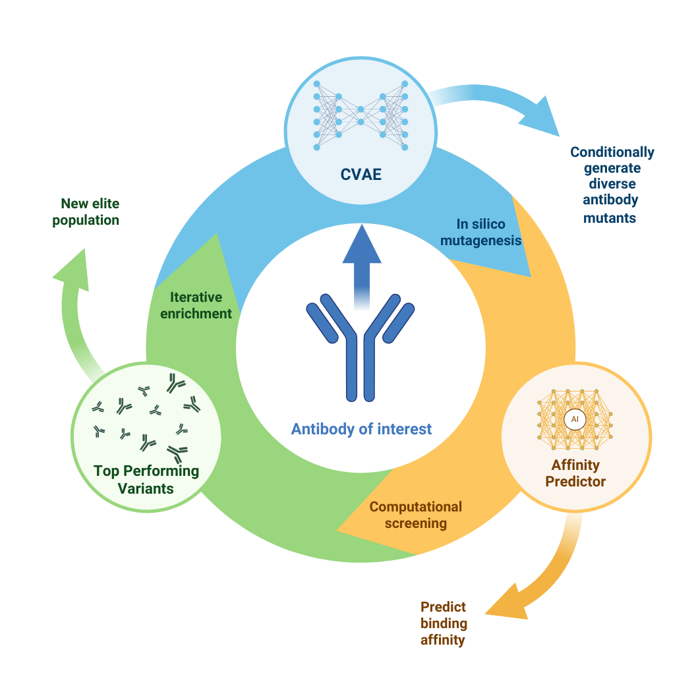
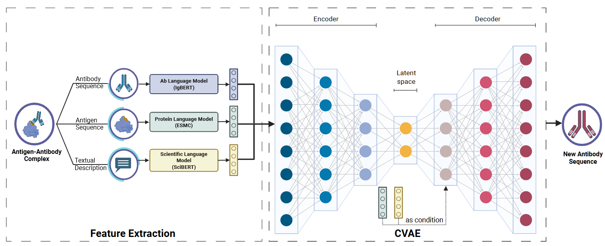

# TeBaAb: Text-Based Antigen-Conditioned Antibody Redesign via Directed Evolution

<p align="center">
    
</p>

An earlier version of this work was presented at NeurIPS 2025 workshops as a non-archival presentation:
- AI for Science: https://openreview.net/pdf?id=Imw5NGMgje
- Machine Learning and the Physical Sciences: https://ml4physicalsciences.github.io/2025/files/NeurIPS_ML4PS_2025_107.pdf 


## Abstract
The design of antibodies with high affinity and specificity for target antigens is a cornerstone of therapeutic and diagnostic innovation. 
Traditional optimization strategies, such as phage or yeast display and directed evolution, remain resource-intensive and limited in their ability to integrate contextual information. 
Recent AI-driven approaches have accelerated protein engineering, but most rely exclusively on structured inputs, overlooking the potential of natural language as a flexible design interface. 
In this work, we introduce TeBaAb, a novel text-based antigen-conditioned framework for antibody redesign that combines generative modeling with iterative optimization inspired by directed evolution. 
TeBaAb integrates a Conditional Variational Autoencoder (CVAE) jointly conditioned on antigen sequences and textual descriptions of antibody properties, coupled with a two-stage binding affinity predictor and an iterative enrichment loop. 
To support this approach, we curated AbDes, a new dataset of 7,684 text–antibody–antigen pairs with accompanying structural and binding information. 

In silico experimental evaluations demonstrate that TeBaAb improves the predicted binding affinity by an average of $10\%$ compared to the original antibodies, while preserving structural confidence (RMSPE $<$ 1.0 Å) and generating sequences that are diverse and novel. 
By enabling text-conditioned antigen-specific antibody design, TeBaAb provides a promising new paradigm for accelerating therapeutic antibody discovery and expanding the antibody design space beyond traditional methods.

## CVAE framework

<p align="center">
    
</p>


## Table of Contents

- [Installation](#installation)
- [Usage](#usage)
  - [Datasets](#datasets)
  - [Configuration](#configuration)
  - [Training](#training)
  - [Antibody Design](#antibody-design)
- [Evaluation](#evaluation)

---


## Installation

### Requirements

- Python 3.10 or higher
- A virtual environment (e.g., `venv` or `conda`) is recommended
- Dependencies listed in `requirements.txt`

### Steps

1. Clone the repository:
   ```bash
   git clone https://github.com/HySonLab/TeBaAb.git
   cd TeBaAb
   ```

2. Set up a virtual environment and install dependencies:
    ```bash
    conda env create -f environment.yml 
    ```
    or
    ```bash
    python -m venv venv
    source venv/bin/activate  # On Windows: venv\Scripts\activate
    pip install -r requirements.txt
    ```

3. Create the checkpoints directory:
   ```bash
   mkdir -p checkpoints
   ```

---

## Usage

### Datasets

- **AbDes**: Contains antibody-antigen sequences paired with text descriptions.
  - **Download**: [Hugging Face: AbDes](https://huggingface.co/datasets/HySonLab/AbDes)
  - **Path**: `datasets/abdes`

Ensure datasets are placed in the specified paths or update configuration files accordingly.

### Configuration

Configuration is managed via YAML files in `configs/`:
- `training.yaml`: Defines architectures for protein/text encoders, CVAE, and fitness predictor.
- `optimize.yaml`: Configures directed evolution parameters (e.g., generations, mutation rate).

### Preparing Data
Extract and preprocess the dataset:
```bash
cd datasets

python3 extract_embedding.py \
    --input_csv ./abdes/train.csv \
    --output_dir ./cvae \
    --output_prefix train \
    --modality all \
    --embedding_type pooler \
    --device cuda:0 \
    --esmc_cache /path/to/esmc_300m_2024_12_v0.pth
```


### Training

1. **Train the CVAE**:
   ```bash
   ./scripts/run_train_cvae.sh
   ```
   - Trains on `datasets/cvae`.

2. **Train the Oracle**:
   ```bash
   python3 scripts/train_predictor.py
   ```
   - Trains on `datasets/affinity`.

### Antibody Design

Generate and optimize protein sequences using directed evolution:
```bash
./scripts/optimize.py
```

---

## Evaluation

### Training Metrics
- **CVAE**: Reconstruction loss, KL divergence, validation loss.
- **Oracle**: Mean Squared Error (MSE) for fitness prediction.

### Antibody Design Metrics
- Binding affinity scores from the oracle.
- Diversity, novelty.
- 3D Structure Error: [ABodyBuilder2](https://opig.stats.ox.ac.uk/webapps/sabdab-sabpred/sabpred/abodybuilder2/)
- Antibody Developability: [TAP](https://opig.stats.ox.ac.uk/webapps/sabdab-sabpred/sabpred/tap)

---

## Affinity validation of optimized antibody

To assess whether the complexes produced by TeBaAb truly exhibit improved binding affinity, we performed a systematic validation combining antibody–antigen docking and computational affinity prediction. The process includes two procedures: (1) validating affinity–prediction tools using reference antibody complexes from SAbDab, and (2) comparing the predicted affinity of the optimized complexes against the original complexes

### Software & Tools: 
- **Docking**: [HADDOCK v2.5](https://www.bonvinlab.org/software/haddock2.5/) (Local installation)
- **Affinity Prediction**: [PRODIGY](https://github.com/haddocking/prodigy) and [CSM-AB](https://biosig.lab.uq.edu.au/csm_ab/)


---

## Stereochemical Quality and Structural Validity

To evaluate the quality, reliability, and structural plausibility of the antibody-antigen complexes generated by our docking pipeline, we applied several well-established structure-validation tools: ERRAT, VERIFY3D, PROCHECK and WHATCHECK, which are available at [SAVES v6.1 - UCLA](https://saves.mbi.ucla.edu/).

---


## Please cite our work

```bibtex
@inproceedings{
nguyen2025tebaab,
title={TeBaAb: Text-Based Antigen-Conditioned Antibody Redesign via Directed Evolution},
author={Cuong Manh Nguyen and Huy-Hoang Do-Huu and Viet Thanh Duy Nguyen and Truong-Son Hy},
booktitle={NeurIPS 2025 AI for Science Workshop},
year={2025},
url={https://openreview.net/forum?id=Imw5NGMgje}
}
```
